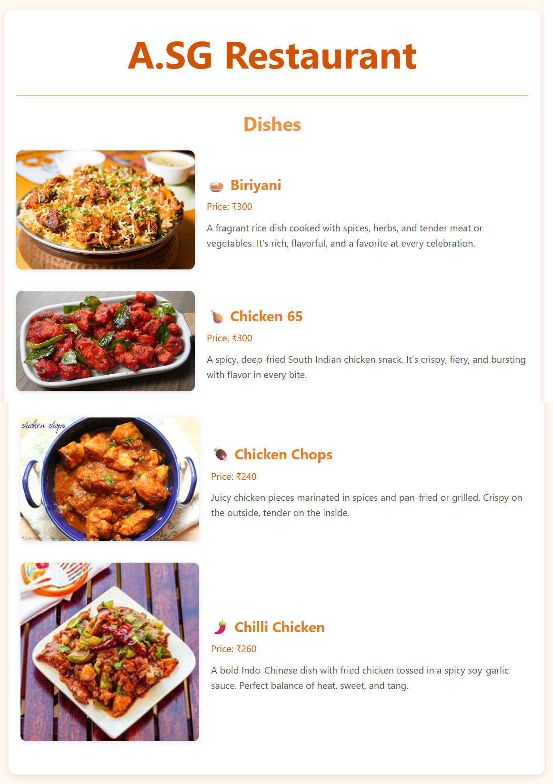

# 🍽️ A.SG Restaurant - Menu Card

This is a simple, stylish restaurant **menu card webpage** built using **HTML** and **CSS**. It showcases a few delicious dishes with images, prices, and descriptions. Created as part of my web development practice.

##  Project Structure

├── index.html # Main HTML file
├── style.css # Styles for the page

##  Screenshots
()

##  Features

- Responsive layout
- Clean and modern design
- Images and info for each dish
- Practice project using plain HTML & CSS

##  How to Run

1. Clone or download the repo
2. Open `index.html` in your browser

## Learnings

- Basic layout with Flexbox
- Styling components
- Organizing small projects

##  Credits

- Images are sourced from the internet for practice purposes.
- No frameworks or libraries used — just vanilla HTML/CSS.
